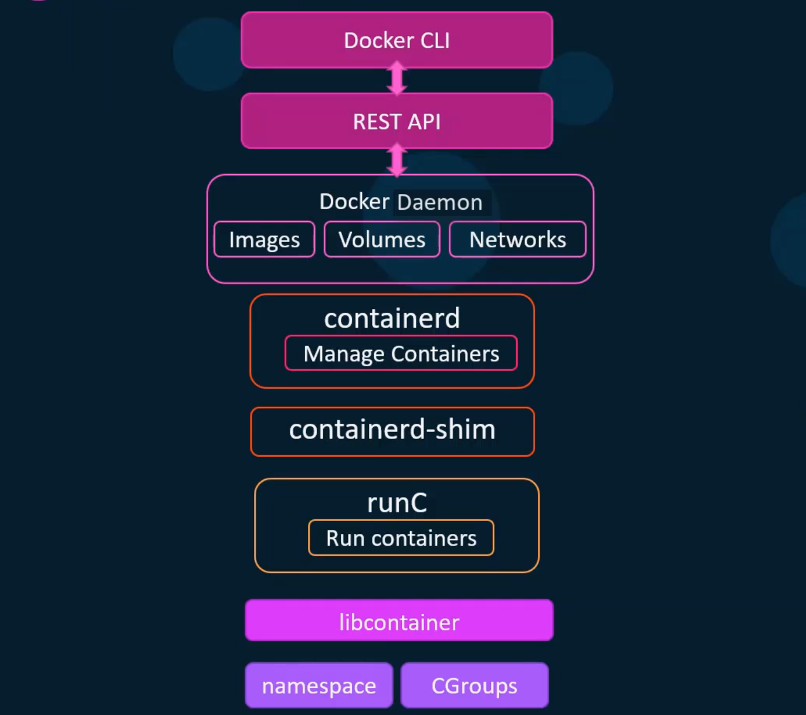

### Docker Engine architecture


* `libcontainer` - execution environment that replaced LXC. It helps Docker to directly managed Kernel level features such as namespace & cgroups
* `runC` - OCI based technology is a part that runs containers. Can be installed without Docker but lacks features provided by Docker
* `containerd` - the daemon that manage containers. It manages runC which in turn use containerd-shim to run containers on a host
* `containerd-shim` - makes containers daemonless for scenarios where docker daemon goes down. It runs containers using runC which in turn uses libcontainer and also monitors their state. If the docker daemon goes down or restarted, containers will run in the background and are attached back when the docker daemon comes back up.

### Docker Daemon service configuration

* `dockerd --debug` - generally used when debugging docker daemon as a foreground process
* `/var/run/docker.sock` - When the docker daemon starts, it listens on an internal Unix socket at /var/run/docker.sock. A Unix socket is an IPC mechanism that is used for communication between different processes on the same host. This means that the docker daemon is only accesible within the same host.
* `dockerd --debug --host=tcp://192.168.1.10:2375` - would expose docker daemon on a TCP interface available at 192.168.1.10 on port 2375
    * On a different host, you would export the DOCKER_HOST environment to target the docker cli to a docker daemon running on a different host. For example: `export DOCKER_HOST="tcp://192.168.1.10:2375"`
    * No encryption or authentication is enabled by default
* `dockerd --debug --host=tcp://192.168.1.10:2376 --tls=true --tlscert=<path> --tlskey=<path>` - to encrypt the traffic using TLS
    * Note that the TLS port is 2376 as opposed to 2375 which is used for unencrypted traffic
* `/etc/docker/daemon.json` - default location that can be used to configure the docker daemon via a configuration file. Not created by default. For example:
```json
{
    "debug": true,
    "hosts": ["tcp://192.168.1.10:2376"],
    "tls": true,
    "tlscert":  "<path>",
    "tlskey":  "<path>"
}
```

### Basic container operations

* New Syntax: `docker <docker-object> <sub-command> [options] <Arguments/Commands>`
    * Example
        * docker container run -it ubuntu
        * docker image build .
        * docker container attach ubuntu
        * docker container kill ubuntu

### Interacting with containers

* Escape sequence to detach from a container `[Press Ctrl+p+q]`
* System stats of a container - `docker container stats`
* Events from dockerd - `docker system events --since 60m`
* Linux signals
    * `kill -SIGSTOP <pid>|$(pgrep <process-name>)` - pauses the process, state is preserved so the process can be resumed.
    * `kill -SIGCONT $(pgrep process-name)`
    * `kill -SIGTERM $(pgrep process-name)` - graceful shutdown a process. It depends on the process to interpret the SIGTERM signal to kick-off of a graceful shutdown process or ignore it. - Docker equivalent: `docker container stop <container-name>`
    * `kill -SIGKILL $(pgrep process-name)` - force shutdown. Docker equivalent: `docker container stop <container-name>`
* Note - In case of docker container stop command, docker sends the SIGTERM signal first and then sends SIGKILL after a grace period
* docker container pause and unpause command use freezer cgroup as opposed to Linux signals such as SIGSTOP and SIGCONT. However, `docker container kill --signal 9` command can be used to send a Linux signal to container
* `docker container ls -q` - list only container IDs of the running containers
* `docker container stop $(docker container ls -q)` - stops all the running containers
* `docker container rm $(docker container ls -qa)` - remove all the containers

### Container Restart Policies

* `no` - containers are never automatically restarted
* `on-failure` - restart only when failed. If exit code is non-zero
* `always` - restart always. If the exit code is zero or non-zero. If the container is manually stopped using docker container stop command, the container with restart policy set to always will start next time the docker daemon restarts
* `unless-stopped` - If manually stopped, the container will not start not even when the docker daemon restarts

### Publishing ports

* The host running docker has multiple network interfaces attached to it and also has IP address on each of the network provided by those interfaces
* What it you want to limit/expose a container on a specific network?
    * `docker run -p 8000:5000 webapp` - exposes the container on all the interfaces available with host port as 8000 and container port as 5000
    * `docker run -p 192.168.1.5:8000:5000 webapp` - exposes the container on the network 192.168... network even thought multiple interfaces could be present on the host
    * `docker run -p 127.0.0.1:8000:5000 webapp` - container is exposed on the loopback interface and no any other interfaces/network the host is associated with
* `docker run -p 5000 webapp` - exposes the container port 5000 on all interfaces the host is associated with. The port exposed on the host will dynamically allocated from the ephemeral port range
    * Ephemeral port range - 32768 - 60999
    * cat /proc/sys/net/ipv4/ip_local_port_range
* What if we want to expose all the ports that a container will expose to dynamic ports on the host?
    * docker run -P webapp - `-P` option can be used
    * -P options expose the ports on the container that were specified in the EXPOSE instruction of the docker image
    * `docker -P --expose=8080 webapp` - --expose can be used to expose additional ports along with all the ports that docker image expose using the EXPOSE instruction